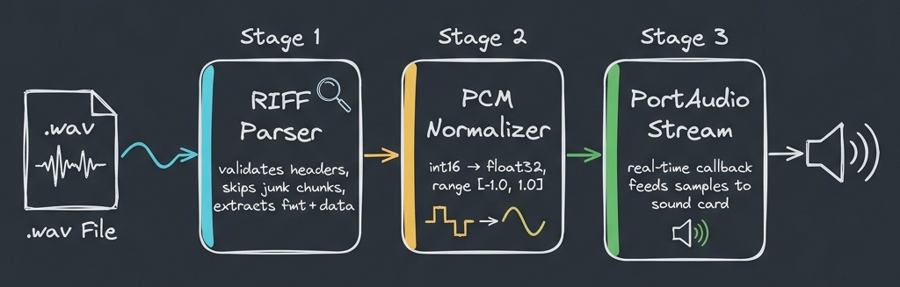
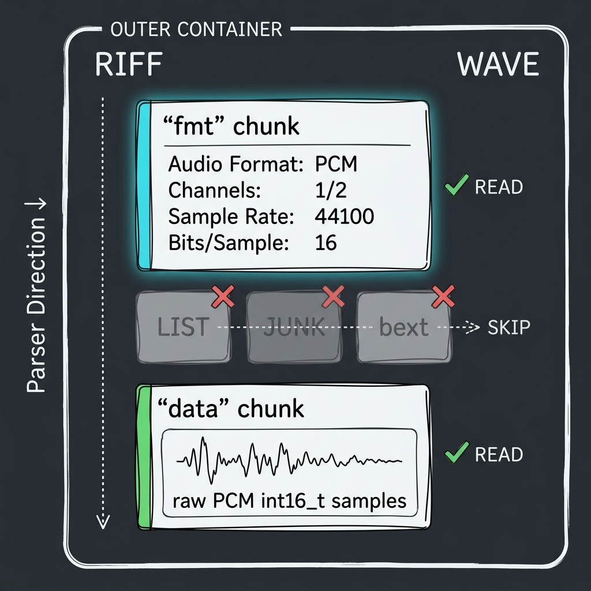
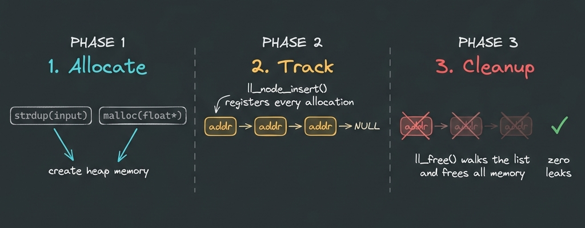

<h1 align="center">WAV Audio Player</h1>

<p align="center">
  A lightweight, terminal-based audio player written in pure C.<br/>
  Reads standard <code>.wav</code> files from disk and plays them through your speakers using <b>PortAudio</b>.
</p>

<p align="center">
  
  
  
  
</p>

---

## How It Works

The player follows a straightforward pipeline. Here's the full picture:

### Pipeline Overview

<p align="center">
  
</p>

The audio goes through **three stages** before it reaches your speakers:

| Stage | What Happens | File |
|-------|-------------|------|
| **1. Parse** | Opens the `.wav` file, validates the RIFF/WAVE container, skips junk chunks, and extracts the `fmt` (format info) and `data` (raw audio) sections | `wav_player.c` |
| **2. Normalize** | Converts raw 16-bit integer samples (`int16_t`) into floating-point values (`float`) in the range `[-1.0, 1.0]` — the format PortAudio expects | `helper_functions.h` |
| **3. Play** | Opens a PortAudio stream, feeds normalized samples to the sound card via a real-time callback function, and handles playback timing | `wav_player.c` |

---

### Inside A WAV File

A `.wav` file isn't just audio data — it's a structured binary container. The parser needs to navigate through it intelligently:



**Key idea:** The parser doesn't assume fixed positions. It reads chunk headers one by one, grabs what it needs (`fmt` and `data`), and skips everything else (`LIST`, `JUNK`, `bext`, etc.). This makes it work with WAV files from different sources — not just perfectly formatted ones.

   - [ READ ] RIFF header → validated "RIFF" + "WAVE" markers 
   
   - [ READ ] chunk: "fmt " (16 bytes) → extracted: PCM, 2ch, 44100Hz, 16-bit 

   - [ SKIP ] chunk: "LIST" (126 bytes) → fseek(126, SEEK_CUR)
   
   - [ SKIP ] chunk: "JUNK" (32 bytes) → fseek(32, SEEK_CUR)

   - [ READ ] chunk: "data" (1843200 bytes) → stored offset, break 


<br clear="left"/>

---

### Memory Management

C doesn't have garbage collection, so this project handles it manually using a **linked list tracker**:


  

Every dynamic allocation (string buffers, user inputs) gets registered into a linked list. At shutdown, `ll_free()` walks the entire chain and frees everything. No leaks.
<br clear="left"/>

---

## Project Structure

```bash
Audio_player/
├── wav_player.c          # Main program — parsing, playback, entry point
├── data_structure.h      # All struct definitions (WAV headers, nodes, playback data)
├── helper_functions.h    # Normalization, input reading, memory tracking, terminal UI
├── decor.h               # ANSI color codes for styled terminal output
└── docs/                 # Architecture diagrams
```

---

## Specifications

| Property | Value |
|----------|-------|
| **Language** | C (requires C11 standard) |
| **Audio API** | [PortAudio](http://www.portaudio.com/) |
| **Supported Format** | WAV — 16-bit PCM, mono or stereo |
| **Sample Rates** | Any standard rate (44100 Hz, 48000 Hz, etc.) |
| **Output Format** | 32-bit floating point (`paFloat32`) |
| **Platform** | Linux (tested on x86-64) |

---

## Build & Run

**Prerequisites:**  
- GCC (with C11 support)  
- PortAudio development library (`libportaudio-dev` on Debian/Ubuntu)

```bash
# Install PortAudio (if not already installed)
sudo apt install libportaudio-dev

# Compile
gcc -std=c11 -o wav_player_pa wav_player.c -lportaudio -lm

# Run
./wav_player_pa

# Run with debug output
./wav_player_pa d
```

The program will prompt you for a file path. Enter the path to any `.wav` file and it plays.

---

## Features

- **Smart WAV parsing** — handles non-standard chunks gracefully instead of crashing
- **Normalized audio output** — converts PCM integers to float for clean playback
- **Real-time callback** — PortAudio pulls samples as needed, no buffer pre-loading delays
- **Built-in memory tracking** — linked list based allocation tracker prevents memory leaks
- **Styled terminal output** — color-coded logs for errors, debug info, and success messages
- **Debug mode** — pass `d` flag to see internal parsing details and memory operations
- **Device info display** — shows your audio hardware specs before playback starts

---

## Demo


https://github.com/user-attachments/assets/1793b326-e359-4834-8a6d-0eb0a014d205


---

## License

This project is open source. Developed by TANISH SHIVHARE [TANISHX1] .
